# Architecture Documentation

Detailed technical architecture for the GFN Carbon Footprint Ingestion Pipeline.

---

## Pipeline Approaches

This project supports two pipeline architectures:

| Approach | Entry Point | Best For | Features |
|----------|-------------|----------|----------|
| **dlt + S3** (Recommended) | `main.py` | Production | Schema evolution, Soda checks, incremental loads |
| dlt Direct | `pipeline_async.py` | Quick local testing | Fast iteration, no S3 |

---

## System Overview

### Recommended Architecture (dlt + S3 Data Lake)

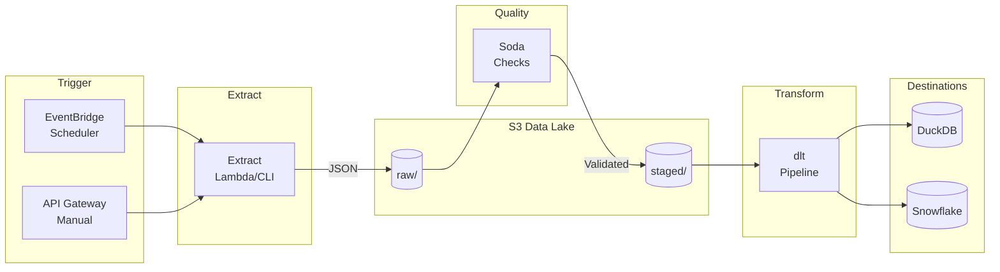

### Data Flow with Soda Checks

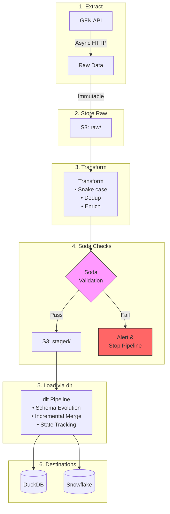

---

## S3 Data Lake Structure

```
s3://gfn-data-lake/
├── raw/                                    # Immutable audit trail
│   └── gfn_footprint_{YYYYMMDD_HHMMSS}.json
├── staged/                                 # Validated, ready for dlt
│   └── gfn_footprint_{YYYYMMDD_HHMMSS}_staged.json
├── transformed/                            # Legacy: for Snowpipe
│   └── gfn_footprint_{YYYYMMDD_HHMMSS}_transformed.json
└── failed/                                 # Dead letter queue
    └── {original_filename}_failed.json
```

### File Naming Convention

| Stage | Pattern | Example |
|-------|---------|---------|
| Raw | `gfn_footprint_{timestamp}.json` | `gfn_footprint_20260131_030733.json` |
| Staged | `gfn_footprint_{timestamp}_staged.json` | `gfn_footprint_20260131_030733_staged.json` |

---

## Soda Data Quality Checks

### Staging Layer Checks

The pipeline runs Soda-style checks on the staging layer before loading to destinations:

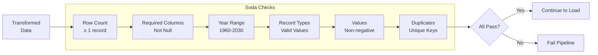

### Check Definitions

| Table | Check | Rule |
|-------|-------|------|
| `footprint_data` | Row count | ≥ 1 |
| `footprint_data` | Required columns | `country_code`, `country_name`, `year`, `record_type` not null |
| `footprint_data` | Year range | 1960 ≤ year ≤ 2030 |
| `footprint_data` | Record types | Must be in valid list (28 types) |
| `footprint_data` | Value | ≥ 0 (non-negative) |
| `footprint_data` | Unique key | No duplicates on `(country_code, year, record_type)` |
| `countries` | Row count | ≥ 1 |
| `countries` | Required columns | `country_code`, `country_name` not null |
| `countries` | Coverage | ≥ 150 unique countries |

### Running Soda Checks

```bash
# Enable Soda checks (fail on error)
make run-soda

# Soda checks in warn-only mode
make run-soda-warn

# Production: Snowflake + Soda + contracts
make run-production
```

---

## Data Transformation Flow

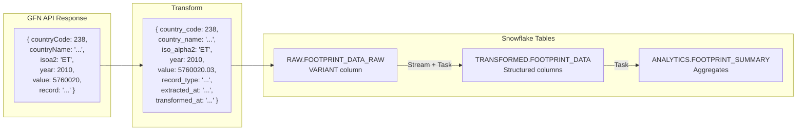

### Transformations Applied

| Transformation | From | To |
|---------------|------|-----|
| Snake case | `countryCode` | `country_code` |
| Standardize | `isoa2` | `iso_alpha2` |
| Add timestamps | - | `extracted_at`, `transformed_at` |
| Deduplicate | - | By `(country_code, year, record_type)` |

---

## dlt Features

### Schema Evolution

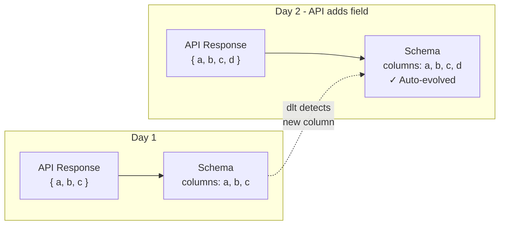

### Incremental Loading

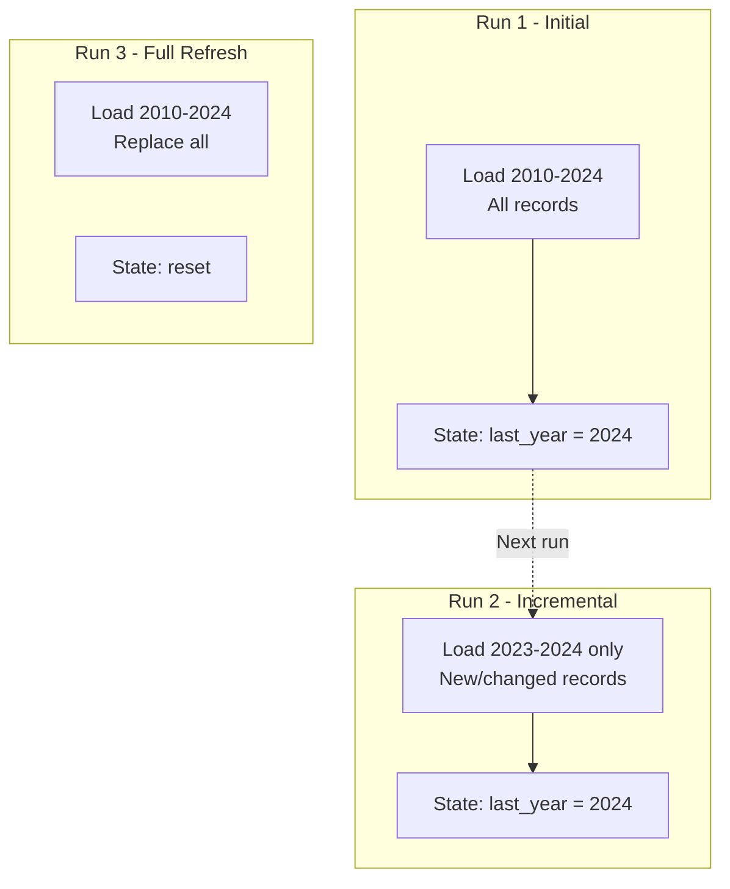

### Data Contracts

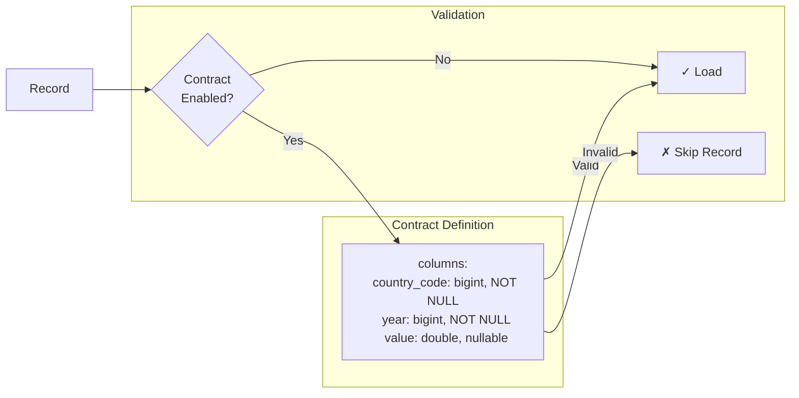

---

## AWS Lambda Architecture (Legacy)

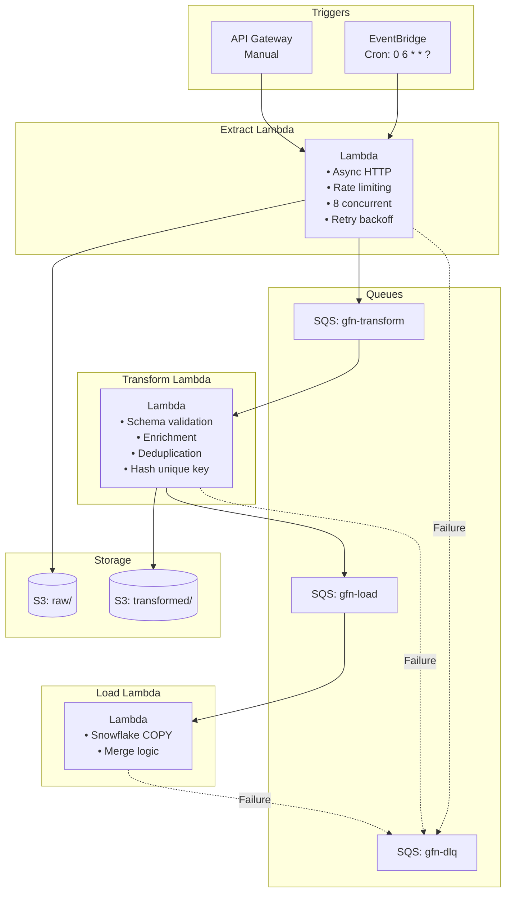

---

## Snowflake Data Flow

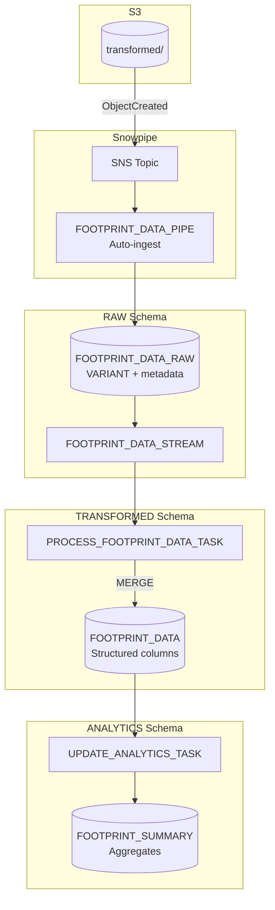

---

## Error Handling

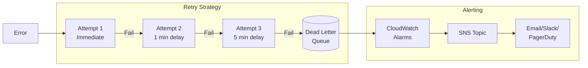

---

## Observability Stack

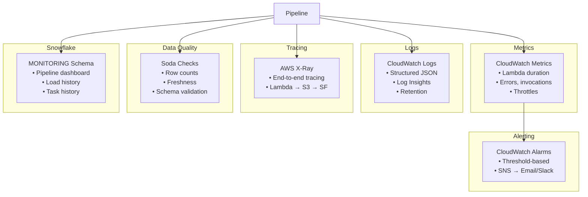

### Snowflake Monitoring Views

| View | Purpose |
|------|---------|
| `V_PIPELINE_DASHBOARD` | Overall pipeline health |
| `V_SNOWPIPE_LOAD_HISTORY` | File load status |
| `V_TASK_HISTORY` | Task execution history |
| `V_DATA_FRESHNESS` | Data recency by table |
| `DATA_QUALITY_METRICS` | Quality check results |

---

## Local Development

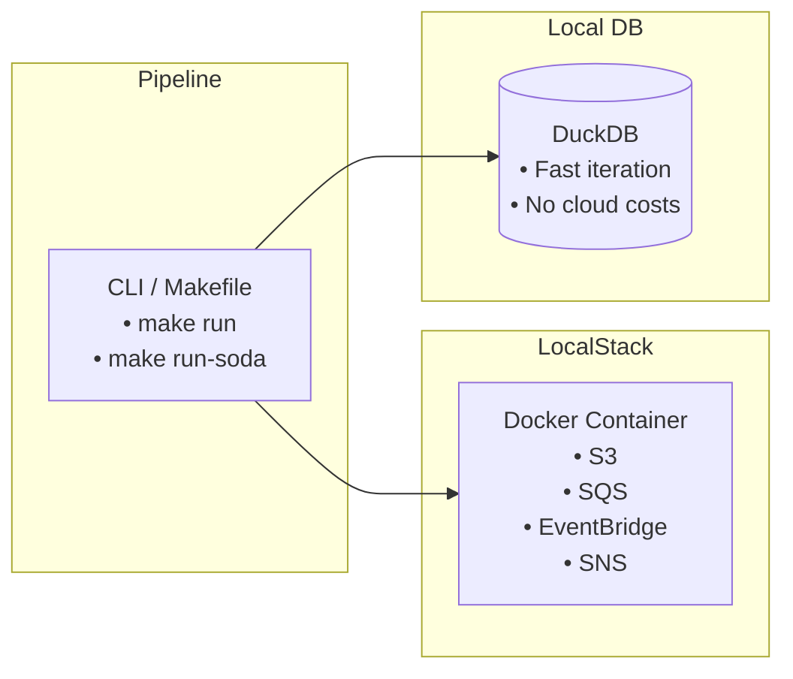

### Commands

```bash
# Start LocalStack + create resources
make setup

# Run dlt + S3 pipeline (recommended)
make run

# Run with Soda checks
make run-soda

# Run production config
make run-production

# Backfill operations
make backfill-recent          # 2020-2024
make backfill-full            # 1961-2024
make backfill YEARS=2010-2015 # Custom range
```

---

## Project Structure

```
global_footprint_network_use_case/
│
├── src/gfn_pipeline/                    # Core pipeline package
│   ├── __init__.py                      # Exports: run_pipeline, gfn_source
│   ├── main.py                          # ✓ RECOMMENDED: dlt + S3 + Soda
│   └── pipeline_async.py                # Async extraction with dlt (direct mode)
│
├── infrastructure/                      # AWS infrastructure
│   ├── lambda_handlers.py               # Lambda functions (extract/transform/load)
│   ├── setup_localstack.py              # LocalStack setup for local dev
│   ├── setup_snowflake_production.py    # Snowflake production setup
│   └── snowflake/                       # Snowflake SQL scripts
│
├── tests/                               # Test suite
│   └── test_pipeline.py                 # Unit and integration tests
│
├── soda/                                # Data quality
│   └── checks.yml                       # Soda check definitions (Snowflake)
│
├── data/                                # Local data storage
│   ├── raw/                             # Raw JSON extracts
│   └── processed/                       # Processed data
│
├── docs/                                # Documentation
│   ├── ARCHITECTURE.md                  # This file
│   └── SNOWPIPE_SETUP.md                # Snowpipe setup guide
│
├── docker-compose.yml                   # LocalStack + services
├── Makefile                             # Build/run commands
└── pyproject.toml                       # Dependencies (uv)
```

---

## Idempotency Strategy

The pipeline is fully idempotent at multiple levels:

| Level | Mechanism | Implementation |
|-------|-----------|----------------|
| File | `LOAD_HISTORY` table | Tracks processed files by name |
| Record | Primary key | `(country_code, year, record_type)` |
| Load | `MERGE` statement | Updates existing, inserts new |

### dlt Merge Pattern

```python
@dlt.resource(
    write_disposition="merge",
    primary_key=["country_code", "year", "record_type"],
)
def footprint_data_resource(...):
    ...
```

---

## API Efficiency

| Approach | API Calls (64 years) | Time |
|----------|---------------------|------|
| Per country/type | ~3,000+ | Hours |
| **Bulk /data/all/{year}** | **~66** | **~2-3 min** |

The pipeline uses the efficient bulk endpoint:
```
GET https://api.footprintnetwork.org/v1/data/all/{year}
```

Returns all countries and record types for a given year in a single call.
